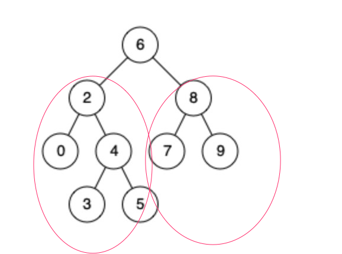

#### 1、题目

#### 2、思路
这道题是一个比较简单的二叉树的题，主要有三种思路。 

##### 1、分治

就是通过将问题分解为子问题，树的最大高度，可以看作左右子树中的最大高度再加1，通过这种思路，可以很简单的写出递归代码。



``` java
class Solution {
    public int maxDepth(TreeNode root) {
        if(root == null){
            return 0;
        }
        int left = maxDepth(root.left);
        int right = maxDepth(root.right);
        return Math.max(left,right)+1;
    }
}
```

##### 2、BFS

BFS通过层层遍历，可以找出最大的树高度然后去更新这个max高度，当遍历完后返回max的值。


``` java
 class Solution {
        public int maxDepth(TreeNode root) {
            if(root == null){
                return 0;
            }
            int max = 0;
            Queue<TreeNode> q = new ArrayDeque();
            q.offer(root);
            while(q.size()!=0){
                int size = q.size();
                for(int i=0;i<size;i++){
                    TreeNode tmp = q.poll();
                    if(tmp.left!=null) q.offer(tmp.left);
                    if(tmp.right!=null) q.offer(tmp.right);
                }
                max++;
            }
            return max;
        }
    }
```

##### 3、 DFS
DFS深度优先遍历，在遍历过程中需要判断该节点是否是叶子结点，是叶子结点，需要和当前的最大深度做比较，如果比当前最大深度大，那么就更新最大深度。


``` java
 class Solution {
        private int max = 0;
        public int maxDepth(TreeNode root) {
            if(root == null){
                return 0;
            }
            dfs(root,0);
            return max;
            
        }
        public void dfs(TreeNode root,int level){
            if(isLeaf(root)){
               if(level+1>max){
                   max = level+1;
               }
                return;
            }
            if(root.left!=null) dfs(root.left,level+1);
            if(root.right!=null) dfs(root.right,level+1);
        }
        public boolean isLeaf(TreeNode root){
            if(root.left == null && root.right == null){
                return true;
            }
            return false;
        }
    }
```

DFS和分治在代码上比较类似，但是思考方式不尽相同，而且在这个问题里分治的代码看起来更加简洁。