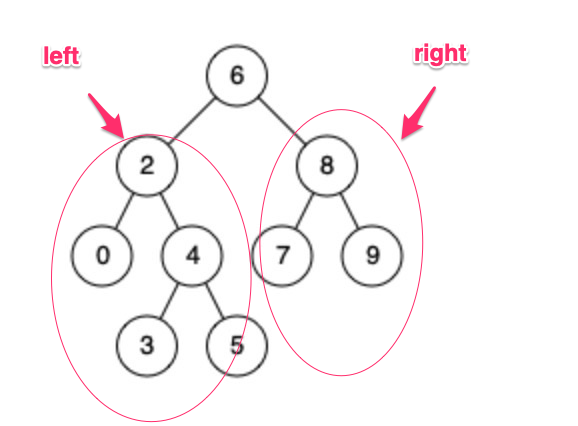

### 二叉搜索树的最小公共祖先

#### 1. 题目

#### 2. 思路
1. 第一种最直接的思路就是遍历路径，找到从rootd到p和q的路径，分别称为qlist和plist从两个list中找出最深的节点，这种方法思维较为直接，但是实现起来代码较为啰嗦，且时间复杂度为O(3N)中间会重复遍历节点。

2. 第二种思路是一种递归的思路，把树看成左子树、根、右子树三部分，如果pq都在左子树中，那么公共祖先肯定在左子树中，同理pq都在右子树中，那么公共祖先肯定在右子树中，若pq分别在左右子树中，那么公共祖先必然是根节点，从该思路出发可以得到一个递归的解法。

代码实现:
  
~~~ java 

class Solution {
    public TreeNode lowestCommonAncestor(TreeNode root, TreeNode p, TreeNode q) {
        return findPorQ(root,p,q);
    }
    public TreeNode findPorQ(TreeNode root, TreeNode p, TreeNode q){
        if(root == null||root == p || root == q){
            return root;
        }
        TreeNode left = findPorQ(root.left,p,q);
        TreeNode right = findPorQ(root.right,p,q);
        if(left == null){
            return right;
        }
        else{
            if(right == null){
                return left;
            }
            else{
                return root;
            }
        }
    }
}
~~~

#### 3.优化思路
由于该题目说明是二叉搜索树，因此可以利用搜索树的特性左子树小于根节点，右子树大于根节点来循环遍历，可以不用递归实现,这种实现方式更加简洁，效率也更高，因为通过二叉搜索树的特性减少了遍历的节点。

~~~ java
class Solution {
    public TreeNode lowestCommonAncestor(TreeNode root, TreeNode p, TreeNode q) {
        if(p.val>root.val&&q.val>root.val){
            return lowestCommonAncestor(root.right,p,q);
        }
        else if(p.val<root.val&&q.val<root.val){
            return lowestCommonAncestor(root.left,p,q);
        }
        else{
             return root;
        }
       
    }
    
}
~~~