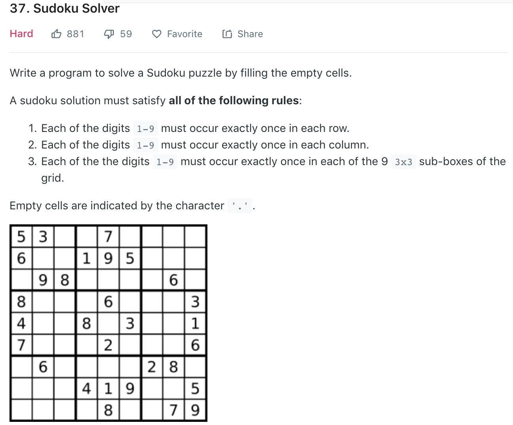

#### 1、题目

#### 2、思路
1. 朴素DFS  
这道题最直观的思路就是最简单的深度优先遍历，首先找到没有放数的格子，遍历‘1’～‘9’,验证该数字是否能放在该格，然后递归下一层，实际这个流程和N皇后问题是类似的，在下一层无法满足条件的情况下，回溯回上一层，如果仍然无法满足，继续向上回溯，直到返回fales;

	那么代码可以分成两个方法，第一个是验证该字符能否放在这个位置，第二个就是向下递归的函数。代码如下：可以看到朴素DFS的解题思路还是比较简单清晰的
	
	```java
	class Solution {
	    public void solveSudoku(char[][] board) {
	        solve(board);
	    }
	    public boolean solve(char[][] board){
	        for(int i = 0; i < 9; i++)
	            for(int j = 0; j < 9; j++){
	                if (board[i][j] == '.'){
	                    for(char k = '1'; k <= '9';k++){
	                        if(valid(board, i, j, k)){
	                            board[i][j] = k;
	                            if(solve(board)){
	                                return true;
	                            }
	                            else{
	                                board[i][j] = '.';
	                            }
	                        }
	                    }
	                    return false;
	                }
	            }
	        return true;
	    }
	    public boolean valid(char[][] board,int row,int col,char k){
	        for (int i = 0;i < 9;i++){
	            if (board[row][i] != '.' && board[row][i] == k) 
	                return false;
	            if (board[i][col] != '.' && board[i][col] ==  k) 
	                return false;
	            if (board[3 * (row / 3) + i/3][3 * (col / 3) + i % 3] != '.' && 
	                board[3 * (row / 3) + i/3][3 * (col / 3) + i % 3] ==  k)
	                return false;
	        }
	         return true;
	    }
	}
	```
	
#### 3、优化
朴素DFS方法暴力的遍历了所有情况，那么是否某些情况可以进行“剪枝”呢?答案是肯定的，对于数独来说我在验证某个字符是否可以放进去的时候实际可以得到一个可能成功的数组，里面放进了所有该位置可能的字符。我们记录这些数组，在回溯后直接从这些数组中遍历，就可以减少很多次不必要的遍历了。

#### 4、扩展
数独问题可以抽象为一种叫精确覆盖的问题，学术解释为：

_在一个全集X中若干子集的集合为S，精确覆盖（Exactcover）是指，S的子集S*，满足X中的每一个元素在S*中恰好出现一次。在计算机科学中，精确覆盖问题指找出这样的一种覆盖，或证明其不存在。_

而这种问题有一个特殊解法[Dancing Links](https://www.jianshu.com/p/93b52c37cc65)该解法在更大数据集合的精确覆盖问题中有更好的表现。