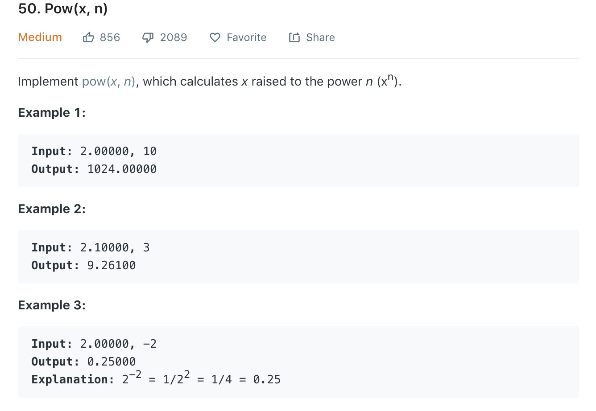

### 1、题目

### 2、思路
1. 这道题一个比较明显的思路就是暴力求解，一个一个的相乘，最后求出结果，时间复杂度O(N)。
	
	``` java
	class Solution {
	    public double myPow(double x, int n) {
	        double product = 1.0;
	        if(n == 0){
	            return 1;
	        }
	        if(n < 0){
	            x = 1/x;
	            n = -n;
	        }
	        while(n>=1){
	            product = product * x;
	            n--;
	        }
	        return product;
	    }
	}
	
	```
问题在于，在leetcode上使用该方法的话会运行时间超时,所以应该采用另一种时间复杂度更低的思路。  
2. 第二种思路就是分治了，把一个大问题分解为多个小问题，再通过小问题的解的合并来获得问题的解。这种思路要求问题与问题之间不存在关联，每个小问题都可以独立求解。就这道题来说，小问题之间是可以独立求解的，相互之间没有什么关联。  

	n个x相乘可以划分为两堆n/2个x相乘，然后继续划分下去，这样的话时间复杂度就控制在O(logN)，但是有两个需要注意的点，一 是n的奇偶性，二 是n的正负，n的奇偶性可以由n%2来区分，当n是负数可以改为n的正数结果的倒数，这里注意的是Inter.MIN_VALUE这个值要特殊处理，直接写为-n会导致数据溢出。实现代码如下
	
	``` java 
	class Solution {
	    public double myPow(double x, int n) {
	        
	        if(n == 0){
	            return 1;
	        }
	       
	        if(n<0){
	            if(n == Integer.MIN_VALUE){
	                return 1/x/myPow(x,-(n+1));
	            }
	            return 1/myPow(x,-n);
	        }
	        if(n%2 == 1){
	            return x*myPow(x,n-1);
	        }
	        return myPow(x*x,n/2);
	    }
	}
	```
