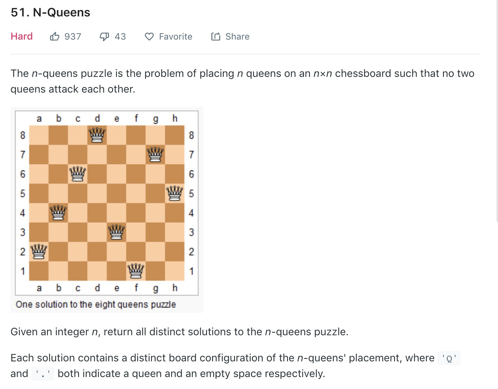

#### 1、题目

#### 2、思路

n皇后问题是一个比较经典的搜索和剪枝的问题，问题的思路是

1. 该问题是一层一层的向下递归，所以适合深度优先搜索。
2. 但是如果每个位置都去遍历，不仅慢而且还要去检验每种结果是否是满足条件的，因此需要在递归过程中进行剪枝，剪枝的条件根据题目规则进行构造。

#### 3、代码编写
具体分析该问题，剪枝条件应该是

1. 不能在任一已放置的Queen的列上。
2. 不能在任一已放置的Queen的斜线上。

其中条件1比较好转换成代码，即col不相等，条件2转换成代码应该怎么做呢，从数学的角度看，不能在Queen的斜线上假设已放置的Queen坐标为[x1,y1]需要放置的Queen坐标为[x2,y2]，那么这个条件可以转换为


$$ \frac{x_1-x_2}{y_1-y_2}=\pm1 $$

可以转换为


 


和
$$x_1+y_1 = x_2+y_2$$

所用可以用3个List分别存放列，列行想加，列行相减这3个值，每次放Queen时可以去检查这3个List有没有重复，若有一个重复，那说明这个Queen的位置就不满足条件。

``` java
class Solution {
    private List<List<Integer>> result= new ArrayList<>();
    private ArrayList<Integer> cols = new ArrayList<>();
    private ArrayList<Integer> pos = new ArrayList<>();
    private ArrayList<Integer> nag = new ArrayList<>();
    public List<List<String>> solveNQueens(int n) {
        dfs(n,0,new ArrayList());
        return helper(result);
    }
    //深度优先遍历
    public void dfs(int n,int row,List<Integer> l){
    //	终止条件
        if (row >= n){
            result.add(l);
            return;
        }
        每层的每个位置都放置一次检查是否能放下去
        for (int col = 0; col < n; col++){
            if(cols.indexOf(col)>=0||pos.indexOf(col+row)>=0||nag.indexOf(col-row)>=0){
                continue;
            }
            cols.add(col);
            pos.add(col+row);
            nag.add(col-row);
            l.add(col);
            //如果能放下去，继续搜索下一层
            dfs(n,row+1,new ArrayList(l));
            //搜索完下层后，将条件回溯回放置之前，继续遍历下一个位置
            l.remove(l.size()-1);
            cols.remove(cols.size()-1);
            pos.remove(pos.size()-1);
            nag.remove(nag.size()-1);
        }
        
        
    }
    //辅助生成答案
    public  List<List<String>> helper( List<List<Integer>> result){

            if(result.size() == 0){
                return new ArrayList<List<String>> ();
            }
            List<List<String>> res = new ArrayList<List<String>>();
           
            for(List<Integer> l:result){
                System.out.println(l);
                List<String> temp = new ArrayList<>();
                for(Integer i:l){
                    char[] rows = new char[result.get(0).size()];
                    Arrays.fill(rows,'.');
                    rows[i] = 'Q';
                    temp.add(new String(rows));
                }
                res.add(temp);
            }
        return res;
            
    }
}
```
#### 3、小结
代码的关键在于：

1. 找到剪枝条件，在搜索每个位置时进行判断，是否继续向下搜索。
2. 在向下搜索完成后进行回溯，回到放置之前的状态，继续下一列的搜索。